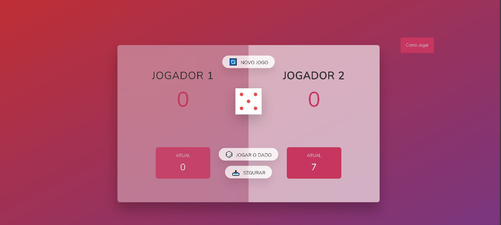
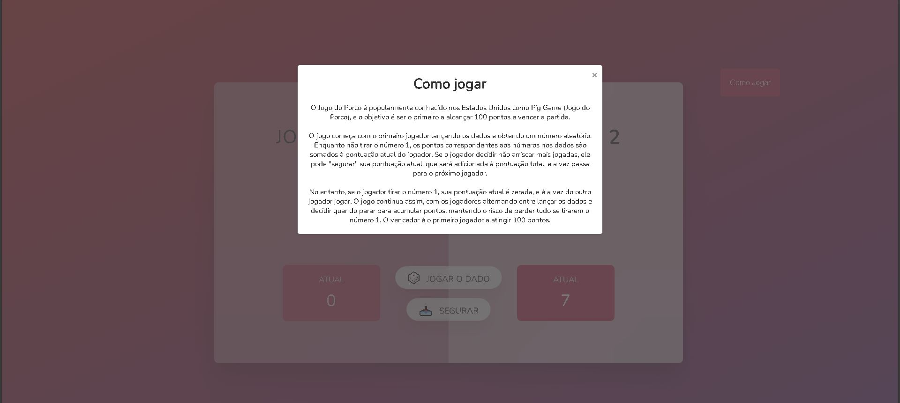

# 🐷 Jogo do Porco

O **Jogo do Porco** (ou "Pig Game") é um jogo americano de dados para dois jogadores, onde o objetivo é ser o primeiro a alcançar 100 pontos sem cair no número 1 do dado!

🎮 Acesse o jogo online: [https://jogo-do-porco.vercel.app](https://jogo-do-porco.vercel.app)

---

## 📸 Preview

---

## 🎯 Regras do Jogo

- Dois jogadores se alternam jogando um dado.
- A cada lançamento, o número sorteado é somado à **pontuação atual** do jogador.
- O jogador pode:
  - Continuar jogando para tentar acumular mais pontos **(risco de perder tudo)**
  - Ou **segurar**, salvando a pontuação atual na **pontuação total** e passando a vez.
- Se o jogador tirar um **1**, ele perde **toda a pontuação atual** e a vez é passada ao outro jogador.
- O primeiro a alcançar **100 pontos totais** vence!

---

## 🛠️ Tecnologias Utilizadas

- **HTML**
- **CSS**
- **JavaScript**

---

## 🚀 Deploy

Este projeto foi implantado utilizando o **Vercel**, uma plataforma gratuita para hospedagem de sites estáticos e frontends modernos.

🔗 Link de acesso: [https://jogo-do-porco.vercel.app](https://jogo-do-porco.vercel.app)

